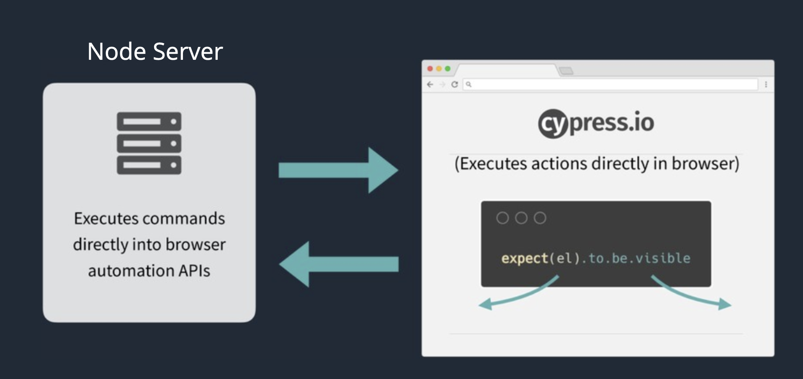

# Généralité (1/2)

## Historique

- Projet démarré en 2015 par Brian Mann
- Début de la public beta en septembre 2017
- Fin de la beta en septembre 2018
- Version actuelle 7.6.0

- Compagnie basé à Atlanta (50 personnes)

## Le but de Cypress

- Tester tout ce qui peut tourner dans le navigateur!

## Architecture

## Ce qui est inclus

- Mocha
- Chaï
- Lodash
- JQuery

<https://docs.cypress.io/guides/references/bundled-tools>
